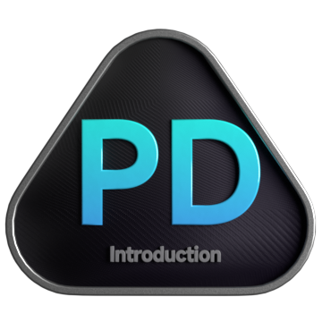

<p align="center">
  
</p>

## Summary
Proficient in Python and possessing a strong foundation in software programming, I quickly grasp and apply complex concepts with ease. My deep understanding of data enables me to swiftly adapt and learn new methodologies.

## About Me

- 🧑‍💻 Knight @Leetcode (1400+ problems)
- 🌱 I’m currently learning Blockchain 🔗.
- 👨‍💻 Developer > CP (Competitive Programming)
- 🐍 Python & JavaScript Developer
- 🔝 Top 30 Global Rank on GeeksforGeeks
- 🛠️ More than 22+ projects

```python
from world import coder as ankit
ankit.work()
```

<!------------------------------------------>
<!-- SECTION:  leetcode badge-->
<br>

<div>
  </img>
  </img>
  </img>
  </img>
  </img>
  </img>
  </img>
  </img>
  </img>
  </img>
  </img>
  </img>
  </img>
  </img>
  </img>
  </img>
</div>
<a href="https://leetcode.com/ankitjha2603/">
    </img>
</a>
<!------------------------------------------>

## Articles/Publications

| Sno | Title                                                                       | Link                                                                                                                                   | Date of Publish |
| --- | --------------------------------------------------------------------------- | -------------------------------------------------------------------------------------------------------------------------------------- | --------------- |
| 0   | शक्ति, भ्रष्टाचार, और समाज: एक अनचाहा चक्र                                       | [Read Article](https://medium.com/@ankitjha2603/%E0%A4%B6%E0%A4%95%E0%A5%8D%E0%A4%A4%E0%A4%BF-%E0%A4%AD%E0%A5%8D%E0%A4%B0%E0%A4%B7%E0%A5%8D%E0%A4%9F%E0%A4%BE%E0%A4%9A%E0%A4%BE%E0%A4%B0-%E0%A4%94%E0%A4%B0-%E0%A4%B8%E0%A4%AE%E0%A4%BE%E0%A4%9C-%E0%A4%8F%E0%A4%95-%E0%A4%85%E0%A4%A8%E0%A4%9A%E0%A4%BE%E0%A4%B9%E0%A4%BE-%E0%A4%9A%E0%A4%95%E0%A5%8D%E0%A4%B0-f8de6adbab03)  | Aug 1, 2024   |
| 1   | Proposed Law: Transparency in Product Manufacturing and Ethical Labeling    | [Read Article](https://medium.com/@ankitjha2603/proposed-law-transparency-in-product-manufacturing-and-ethical-labeling-bc4dd4add53c)  | July 28, 2024   |
| 2   | Optimism and Realism                                                        | [Read Article](https://medium.com/@ankitjha2603/optimism-and-realism-6b8edb2fcb8a)                                                     | July 5, 2024    |
| 1   | Cycle of Overthinking                                                       | [Read Article](https://www.linkedin.com/pulse/cycle-overthinking-ankit-kumar-jha-1tsyf)                                                | June 22, 2024   |
| 2   | Challenging Infinity                                                        | [Read Article](https://medium.com/@ankitjha2603/challenging-infinity-be1b626c5a96)                                                     | May 21, 2024    |
| 3   | Being Genius: A Journey of Self-Discovery                                   | [Read Article](https://www.linkedin.com/pulse/being-genius-journey-self-discovery-ankit-kumar-jha-pfxrf)                               | May 12, 2024    |
| 4   | Understanding Depression: Beyond the Myths and Misconceptions               | [Read Article](https://www.linkedin.com/pulse/understanding-depression-beyond-myths-misconceptions-ankit-kumar-jha-bqd1f)              | May 4, 2024     |
| 5   | How to Start Programming and Begin Problem-Solving                          | [Read Article](https://www.linkedin.com/pulse/how-start-programming-begin-problem-solving-practical-ankit-kumar-jha-cehnf)             | Apr 21, 2024    |
| 6   | Book of Luck                                                                | [Read Article](https://www.linkedin.com/pulse/book-luck-ankit-kumar-jha-cdycf)                                                         | Apr 13, 2024    |
| 7   | The 3-Page Productivity Hack                                                | [Read Article](https://www.linkedin.com/pulse/3-page-productivity-hack-prioritize-organize-your-ankit-kumar-jha-mcgwf)                 | Apr 1, 2024     |
| 8   | Optimized version of the Sieve of Eratosthenes                              | [Read Article](https://www.linkedin.com/pulse/optimized-version-sieve-eratosthenes-generating-prime-ankit-kumar-jha-m3bpc )            | Mar 21, 2024    |


<!------------------------------------------>
<!-- SECTION: contact me -->

## 💻 Coding Profiles

- **LeetCode:** [ankitjha2603](https://leetcode.com/ankitjha2603/)
- **GeeksforGeeks:** [ankitjha2603](https://auth.geeksforgeeks.org/user/ankitjha2603)

## 🌐 Online Presence

- **Website:** [ankitjha2603.github.io](https://ankitjha2603.github.io/)
- **linkedin:** [ankitjha2603](https://linkedin.com/in/ankitjha2603)
- **YouTube:** [CognitiveAnkit](https://www.youtube.com/@cognitiveAnkit)
- **Instagram:** [cognitiveAnkit](https://www.instagram.com/cognitiveAnkit/)
- **Email:** <a href="mailto:ankitjha2603@gmail.com">ankitjha2603@gmail.com</a>

[](https://visitcount.itsvg.in)
